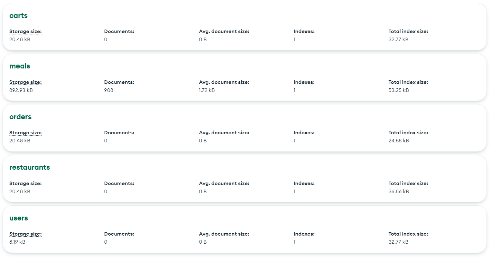
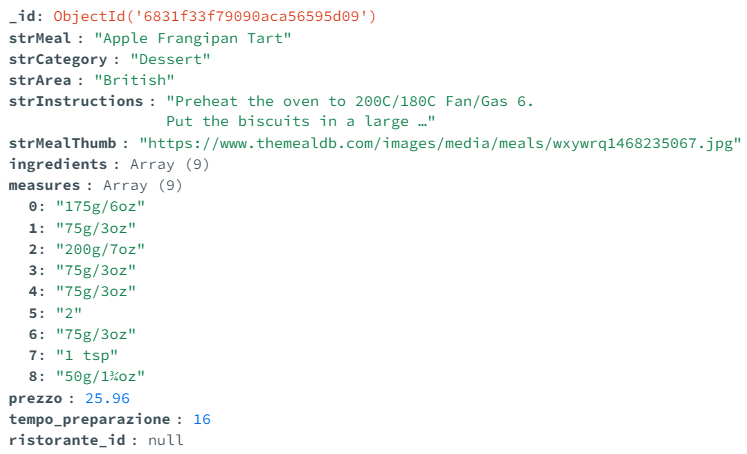

<h1>Relazione Progetto di Programmazione Web e Mobile - A.A 2025/2026 - Fast Food - Ingenito Emiddio</h1>

---

# Getting Started

Per avviare l’applicazione, navigare nella directory `fastfood`, ed installare i `node_modules` necessari eseguendo il comando `npm install`

Successivamente, è possibile avviare il backend mediante il comando `npx nodemon index.js.`

E’ possibile raggiungere la pagina iniziale, aprendo il file `index.html`

# Struttura della directory

```
┣ 📂Documents
	//Traccia del progetto, swagger
┃ ┣ 📜meals.json
┃ ┣ 📜PWM__project_25_26.pdf
┃ ┣ 📜swagger.js
┃ ┗ 📜swagger.json
┣ 📂middlewares
	//Verifica validità token JWT e ruolo utente autenticato,
	per la protezione delle APIs
┃ ┣ 📜authenticateUser.js
┃ ┗ 📜authorizeRistoratore.js
┣ 📂public //Frontend
┃ ┣ 📂assets //Contenuto statico
┃ ┃ ┗ 📜logo.png
┃ ┣ 📂cliente //Pagine d'accesso esclusivo a clienti
┃ ┃ ┣ 📜carrello.html
┃ ┃ ┣ 📜home.html
┃ ┃ ┣ 📜menu.html
┃ ┃ ┗ 📜ordini.html
┃ ┣ 📂ristoratore //Pagine d'accesso esclusivo a ristoratori
┃ ┃ ┣ 📜creaRistorante.html
┃ ┃ ┣ 📜gestioneRistorante.html
┃ ┃ ┣ 📜home.html
┃ ┃ ┣ 📜modificaPiattoPersonalizzato.html
┃ ┃ ┣ 📜ordini.html
┃ ┃ ┣ 📜piattiGenerici.html
┃ ┃ ┣ 📜piattoPersonalizzato.html
┃ ┃ ┗ 📜statistiche.html
	//Pagine d'accesso comune, sia per clienti che per ristoratori
┃ ┣ 📜index.html
┃ ┣ 📜login.html
┃ ┣ 📜logout.html
┃ ┣ 📜profilo.html
┃ ┗ 📜register.html
┣ 📂routes
	//Backend, Diversi router, ognuno gestisce diversi endpoints, raggruppati per scenari
┃ ┣ 📜carts.js
┃ ┣ 📜meals.js
┃ ┣ 📜orders.js
┃ ┣ 📜restaurants.js
┃ ┗ 📜users.js
┣ 📂utils //Caricamento informazioni da file .env
┃ ┗ 📜config.js
┣ 📜.env 
┣ 📜index.js //Server Express, utilizza i router per esporre una API REST
┗ 📜package.json
```

# Struttura del Database

E’ stato utilizzato un DB MongoDB, memorizzato in cloud sulla piattaforma Atlas.

## Collections

All’interno del DB “fastfood”, sono memorizzate 5 collections:



- carts - Contiene per ogni utente, un “carrello” di piatti,  con associate le rispettive quantità e ristorante da cui si intende ordinarli.
- meals - Al contenuto dell’allegato meals.json, sono stati rimossi alcuni attributi, e aggiunti degli altri:
    

    
Ogni piatto è identificato da un indice. Inoltre, sono stati aggiunti i campi “`prezzo`” (in euro), “`tempo_preparazione`” (in minuti), e `ristorante_id`, il cui valore è `null` per i piatti generici, e corrisponde all’`id` di un ristorante registrato, per i piatti personalizzati di uno specifico ristorante.
    
- orders - Ordini effettuati
- restaurants - Ristoranti registrati
- users - Utenti registrati (sia clienti che ristoratori, è presente un campo “role” per distinguerli)

# Swagger

Una volta eseguito il codice, uno **swagger** opportunamente descritto è raggiungibile all’URL `http://localhost:3000/swagger`

# Scelte implementative

### Utilizzo di token JWT

Per la gestione delle autorizzazioni d’accesso alle varie pagine ed endpoints dell’API, è stato utilizzato JWT.

Un utente effettua il login mandando all'endpoint `/login` una richiesta POST con username e password. Se le credenziali corrispondono ad un utente regsitrato, il server genera un `JWT` e lo invia al client nella risposta

```
// POST /users/login - login
usersRouter.post("/login", async (req, res) => {
  try {
    const db = req.app.locals.db;
    const { username, password } = req.body;

    if (!username || !password) {
      return res.status(400).json({ error: "username e password sono obbligatori" });
    }

    const user = await db.collection("users").findOne({ username });
    if (!user) {
      return res.status(401).json({ error: "Credenziali non valide" });
    }

    const passwordMatch = await bcrypt.compare(password, user.password);
    if (!passwordMatch) {
      return res.status(401).json({ error: "Credenziali non valide" });
    }

    // genera JWT con userId e role, codificato in base alla chiave memorizzata nel file .env
    const token = jwt.sign(
      { userId: user._id.toString(), role: user.role },
      process.env.JWT_SECRET,
      { expiresIn: process.env.JWT_EXPIRES_IN }
    );

    res.json({ token });
  } catch (err) {
    console.error(err);
    res.status(500).json({ error: "Errore nel login" });
  }
});

```

Questo token è memorizzato dal client nel `localstorage`, che potrà accedere alle API protette, allegando il token ad ogni richiesta.

### Hashing Password

Le password sono memorizzate mediante hash, utilizzando la libreria `bcrypt`

### Relazioni con entità ristorante e ristoratore

Ad ogni utente ristoratore, può essere associato un solo ristorante.

Ad ogni ristorante, è associato un solo menu, memorizzato al suo interno come un array di `id` a piatti contenuti nella collection `meals`.

Per la ricerca dei piatti, prima scelgo il ristorante, poi dai suoi piatti scelgo cosa voglio mangiare.

### Middlewares

Uso di middlewares per la protezione delle API

Gli endpoints che richiedono un’autenticazione da parte di un utente, sono protette grazie alla presenza di due middlewares, per la verifica di un token JWT valido, e il controllo del ruolo del cliente autenticato, per le API riservate ai soli ristoratori.

```jsx
import jwt from "jsonwebtoken";

const authenticateUser = (req, res, next) => {
  try {
    const authHeader = req.headers.authorization;
    if (!authHeader || !authHeader.startsWith("Bearer ")) {
      return res.status(401).json({ error: "Token mancante o formato non valido" });
    }
    const token = authHeader.split(" ")[1];
    const payload = jwt.verify(token, process.env.JWT_SECRET);
    if (!payload.userId || !payload.role) {
      return res.status(401).json({ error: "Token non valido: mancano dati utente" });
    }

    req.user = { _id: payload.userId, role: payload.role };
    next();
  } catch (err) {
    return res.status(401).json({ error: "Token non valido o scaduto" });
  }
};

export default authenticateUser;

```

### Memorizzazione carrello nel DB

Ho deciso di memorizzare il carrello dei singoli utenti nel DB in una collection dedicata, piuttosto che nel localstorage, per far si che esso non venga perso al logout o se si cambia dispositivo (stile ecommerce, il carrello è associato all’account).

### Gestione piatti personalizzati

I Piatti personalizzati sono memorizzati nella stessa collection che contiene i piatti “generici”, ciò che li distingue da essi, è la presenza di un valore in corrispondenza dell’attributo `ristorante_id`

### Sistema di ordine

All’interno della pagina “carrello”, l’utente troverà tutti i piatti aggiunti, divisi in base al ristorante da cui essi sono stati ordinati.

Per ogni ristorante, è possibile se ritirare i prodotti in loco, oppure farseli consegnare a casa, all’indirizzo indicato durante la registrazione.

Cliccando il pulsante “ordina”, gli ordini vengono correttamente smistati ai vari ristoranti.

### Ritiro in ristorante

Se l’ordine è indicato per il ritiro nel ristorante, segue il flusso di stato “`ordinato`”, “`in preparazione`”, “`consegnato`”.

In questo caso, sarà il ristoratore, tramite la propria dashboard, ad indicare l’avanzamento dello stato dell’ordine.

### Consegna a domicilio

Il ristoratore, tramite la propria dashboard, può far avanzare lo stato dell’ordine fino a “in consegna”, seguendo il flusso   “`ordinato`”, “`in preparazione`”, “`in consegna`”.

Dopo di che darà l’ordine ad un fattorino, e sarà il cliente dalla sua pagina “ordini” a confermare la ricezione dell’ordine, tramite bottone dedicato.

Il flusso di stato dell’ordine è quindi “`ordinato`”, “`in preparazione`”, “`in consegna`”, “`consegnato`”

Per entrambe le casistiche, l’ordine va automaticamente “`in preparazione`” se è il primo della coda del ristorante

# Schermate e prove di funzionamento

E’ disponibile un video dimostrazione del funzionamento del progetto, al link

[https://www.youtube.com/watch?v=Rsd6FUjZxP4](https://www.youtube.com/watch?v=Rsd6FUjZxP4)
